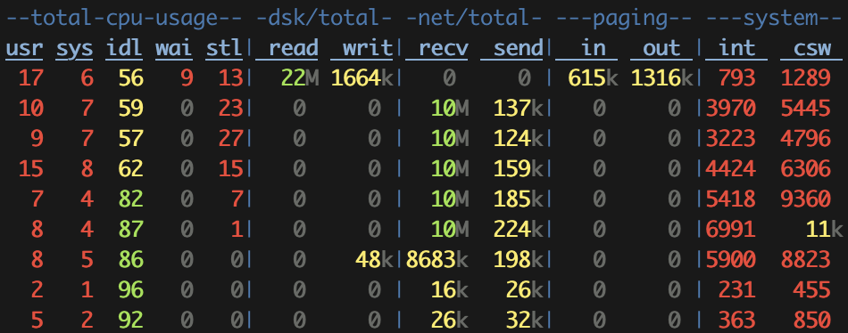
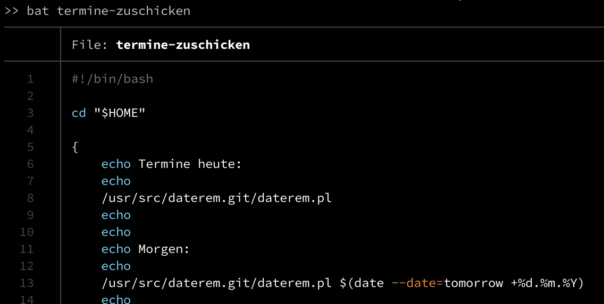

cli stuff
=========

Every now and then I see a Linux(, ...) cli command I've never seen before. The difficult part is to remember it when I need it.

envsubst
--------

Substitute environment variables in a text file. Seen in the Docker sample about Nginx.


entr
----

Run a command when a file (or more files) changes.

Sample usage: `ls | entr echo bla`


ack
---

Search files like grep, excluding .git (and other VCS dirs) automatically.

Example: `ack --perl needle`


jo
--

Create JSON output by a shell command.

Example: `jo name=Jane`

Prints `{"name":"Jane"}`

There are much more possibilities. See [Jan-Piet Mens' site](https://jpmens.net/2016/03/05/a-shell-command-to-create-json-jo/) for a detailed description.


Icinga
------

```
/usr/local/share/icingaweb2/bin/icingacli monitoring list hosts --problems --verbose
/usr/local/share/icingaweb2/bin/icingacli monitoring list services --problems --verbose
```


dstat
-----

Show statistics about system resources. Similar to vmstat and iostat. Includes network throughput.



Category: performance


fio
---

Benchmark testing. Disk throughput.

Example: `fio --rw=readwrite --name=test --size=200M --bs=4M --numjobs=2 --group_reporting --runtime=20 --time_based --refill_buffers`


bc
--

Calculator.

Example: `echo "scale=1000; 4*a(1)" | bc -l`
Calculates 1000 digits for Pi.


comm
----

Compare two text files and shows lines only in file1 (1st column), only in file2 (2nd column), and lines in both files (3rd column).

Example: `comm file1.txt file2.txt`

Find common lines in both files: `comm -12 <(sort file1.txt) <(sort file2.txt)`


cdrecord
--------

Write an ISO image to a CD.

Example: `cdrecord dev=/dev/sr1 speed=12 -dao -eject -v Downloads/clonezilla-live-2.6.4-10-amd64.iso`


ts
--

Timestamp each line. Very useful in a pipe. Package moreutils on Arch Linux. @climagic on Twitter added a `stdbuf -o0 uniq |` before the ts command to only show the line when it has changed (different to previous output line from ps).

Example: `while ps auxw | grep '[d]dclient' ; do sleep 5 ; done | ts`

Example output:

```
Jan 24 16:23:44 root         336  0.0  3.6  21684 13632 ?        S    14:33   0:00 ddclient - sleeping for 20 seconds
Jan 24 16:23:49 root         336  0.0  3.6  21684 13632 ?        S    14:33   0:00 ddclient - sleeping for 10 seconds
Jan 24 16:23:54 root         336  0.0  3.6  21684 13632 ?        S    14:33   0:00 ddclient - sleeping for 10 seconds
Jan 24 16:23:59 root         336  0.0  3.6  21684 13632 ?        S    14:33   0:00 ddclient - sleeping for 300 seconds
Jan 24 16:24:04 root         336  0.0  3.6  21684 13632 ?        S    14:33   0:00 ddclient - sleeping for 300 seconds
Jan 24 16:24:09 root         336  0.0  3.6  21684 13632 ?        S    14:33   0:00 ddclient - sleeping for 290 seconds
```

Also useful with `ping` to see the time the answer was received. Example (destination was rebooted during ping):

```
# ping server | ts
Apr 04 19:33:57 PING server (192.x.x.x) 56(84) bytes of data.
Apr 04 19:33:57 64 bytes from server (192.x.x.x): icmp_seq=1 ttl=64 time=0.371 ms
Apr 04 19:33:58 64 bytes from server (192.x.x.x): icmp_seq=2 ttl=64 time=0.160 ms
Apr 04 19:33:59 64 bytes from server (192.x.x.x): icmp_seq=3 ttl=64 time=0.144 ms
Apr 04 19:34:23 64 bytes from server (192.x.x.x): icmp_seq=27 ttl=64 time=0.105 ms
Apr 04 19:34:24 64 bytes from server (192.x.x.x): icmp_seq=28 ttl=64 time=0.130 ms
Apr 04 19:34:26 64 bytes from server (192.x.x.x): icmp_seq=29 ttl=64 time=0.599 ms
```

I've had a look at the `man ping` page, and I just realized the `-D` parameter. So you can omit `ts` and just use `ping -D`:

```
# ping -D -O server
[1586021966.217813] 64 bytes from server (192.x.x.x): icmp_seq=1 ttl=64 time=0.165 ms
[1586021967.214993] 64 bytes from server (192.x.x.x): icmp_seq=2 ttl=64 time=0.179 ms
[1586021968.221549] 64 bytes from server (192.x.x.x): icmp_seq=3 ttl=64 time=0.146 ms
[1586021969.248159] 64 bytes from server (192.x.x.x): icmp_seq=4 ttl=64 time=0.337 ms
[1586021970.265523] 64 bytes from server (192.x.x.x): icmp_seq=5 ttl=64 time=0.116 ms
[1586021972.313402] no answer yet for icmp_seq=6
[1586021973.341370] no answer yet for icmp_seq=7
[1586021974.361367] no answer yet for icmp_seq=8
...
[1586021987.633862] 64 bytes from server (192.x.x.x): icmp_seq=21 ttl=64 time=978 ms
[1586021987.653106] 64 bytes from server (192.x.x.x): icmp_seq=22 ttl=64 time=0.133 ms
```


progress
--------

Shows the progress of different commands. Can be started when dd is already running. Detects dd, rsync, and many other programs.

Example output of `progess --monitor`:

```
[ 2013] dd /dev/dm-13
        8.5% (5.1 GiB / 60 GiB) 8.0 MiB/s remaining 1:57:12

[ 2017] dd /dev/dm-12
        96.6% (4.8 GiB / 5 GiB) 8.0 MiB/s remaining 0:00:21
```


pv
--

Pipe viewer. Shows the progress of data through a pipeline.

`dd if=... | pv | dd of=...`

(`dd` is just an example, you may also use `dd ... status=progress` in newer dd versions)

You can specify a rate limit using `--rate-limit`. The rate limit can be changed using `pv -R $(pidof pv) -L 102400` (seen in the borg documenation).


pee
---

In a pipe, forward the input to several processes.

`seq 5 -1 1 | pee 'sort > sorted' 'sort -R > shuffled'`

The file `sorted` has 5 lines, having the numbers 1 to 5 sorted ascending. The file `shuffled` has also 5 lines, but with random order.

`/usr/bin/pee` is in Pacman package `moreutils`.

Using bash, the above example can be rewritten without using pee: `seq 5 -1 1 | tee >(sort > sorted) >(sort -R > shuffled)`


inotifywait
-----------

In monitoring mode (`-m`), prints a line every time a file is accessed.

Example: `inotifywait -m /tree/to/index.php`

Everytime you `cat` that file, the output is something like

```
/tree/to/index.php OPEN
/tree/to/index.php ACCESS
/tree/to/index.php CLOSE_NOWRITE,CLOSE
```

`/usr/bin/inotifywait` is in Pacman package `inotify-tools`.


lsof
----

Show open files, or ports.

Example: Which SSH connections are active?

```
# lsof -i tcp:22
COMMAND    PID USER   FD   TYPE DEVICE SIZE/OFF NODE NAME
sshd      5282 root    3u  IPv4  20610      0t0  TCP *:ssh (LISTEN)
sshd      5282 root    4u  IPv6  20612      0t0  TCP *:ssh (LISTEN)
sshd    132409 root    4u  IPv4 544552      0t0  TCP server:ssh->client:45766 (ESTABLISHED)
```


cpulimit
--------

Limit a process' maximum cpu usage.

`cpulimit --limit=60 ffmpeg ...`


paste
-----

Join multiple lines by "," for example.

Examples:

- `echo -e 'a\nb\nc\nd' | paste -sd,` gives `a,b,c,d`

- `ansible 'hostgroup' -m ping | grep SUCCESS | sed 's/ | SUCCESS.*//' | paste -sd ,` gives a list like `host1,host4,host5`


bat
---

Similar tool to the famous `cat` command. Pastes a file. Additionally, it outputs line numbers and does syntax coloring.

`bat FILENAME`




jq
--

A JSON processor. See also ["some jq examples"](../jq/).

Example: `echo '{"foo": 0}' | jq .`

Another example combining jo and jq: `jo time=$(date +%s) dir=$HOME | jq ".time"`

Output: `1593859953`


curl + wttr
-----------

Show weather information.

Default is based on your location. Based on your IP address, I guess.

`curl wttr.in`


curl + qr code
--------------

Generate a qr code using https://qrenco.de.

Example: `printf "sample text" | curl -F-=\<- qrenco.de`


sem and parallel
----------------

Run jobs parallel and limit the number of parallel jobs.

Example: run `sem -j 2 sleep 90 &` multiple times.

Only 2 sleep processes are running at the same time. As one sleep ends, another sleep will be started until all jobs are done.

There's a tutorial avaiable: https://www.gnu.org/software/parallel/parallel_tutorial.html


Another example running multiple sleep processes and exit codes. At the end, there's a nice chart:

```
% parallel --joblog /tmp/log 'sleep {}; exit {}'  ::: 1 2 3 0 0 0 1 1 1  ;  expand /tmp/log
Seq     Host    Starttime       JobRuntime      Send    Receive Exitval Signal  Command
1       :       1595532458.408       1.003      0       0       1       0       sleep 1; exit 1
2       :       1595532459.470       2.006      0       0       2       0       sleep 2; exit 2
3       :       1595532461.617       3.006      0       0       3       0       sleep 3; exit 3
4       :       1595532464.864       0.006      0       0       0       0       sleep 0; exit 0
5       :       1595532465.017       0.006      0       0       0       0       sleep 0; exit 0
6       :       1595532465.114       0.006      0       0       0       0       sleep 0; exit 0
7       :       1595532465.177       1.006      0       0       1       0       sleep 1; exit 1
8       :       1595532466.269       1.006      0       0       1       0       sleep 1; exit 1
9       :       1595532467.378       1.007      0       0       1       0       sleep 1; exit 1
```


expand
------

Replace tab stops by spaces. Similar command: `unexpand`.


neofetch
--------

Show OS logo, current kernel, uptime, etc. information.


rev
---

Reverse a text or file.

Example:

```
% echo "reverse this string" | rev
gnirts siht esrever
```


factor
------

Print the prime factors of numbers.

Example:

```
% factor 17 18 19
17: 17
18: 2 3 3
19: 19
```


figlet
------

Print a banner, using big letters in the console.

Example: `figlet Test`

A different font can be specified using `-f`.

Print the current kernel revision using all fonts avaiable:

`for f in /usr/share/figlet/fonts/*.flf ; do font=$( basename -s .flf $f ) ; echo $font ; uname -r | figlet -kf $font ; done`

The list can also be generated using `for font in $( figlist ) ; do ...`, but some error messages about opening font files may appear.

Similar commands: toilet, banner.

You may also search for "figlet Hello" on DuckDuckGo and you'll get your banner. There are also online generators avaiable.


repeat
------

Repeat a shell command a given number of times.

Example:

```
% repeat 5 sh -c 'echo -n "$(date): " ; ping -c 1 -q localhost | tail -n 1 ; sleep 5'
Fr 24. Jul 14:57:01 CEST 2020: rtt min/avg/max/mdev = 0.033/0.033/0.033/0.000 ms
Fr 24. Jul 14:57:06 CEST 2020: rtt min/avg/max/mdev = 0.024/0.024/0.024/0.000 ms
...
```


fold
----

Wrap input lines to fit in specified width.

Example:

```
% echo a line longer than a few characters | fold --width 21
a line longer than a
few characters
% echo a line longer than a few characters | fold --width 20
a line longer than a
 few characters
% echo a line longer than a few characters | fold --width 20 -s
a line longer than
a few characters
```

Another example: generate lines with random 7-digit numbers

`< /dev/urandom tr -dc '0-9' | fold -w 7`


lolcat
------

Output text in very nice rainbow colors.

Example: `( echo "Kernel:" ; uname -r ) | figlet -tkf banner | lolcat` 


xargs
-----

Runs a command with arguments taken from standard input. Useful if your argument count exceeds the shell limit. Mostly run as `/cmd/that/generates/argument/list | xargs /cmd/that/processes/argument/list`.

(Weird) example: run 5 sleep commands in parallel forever

`yes 2 | xargs -P5 -n1 sleep`
