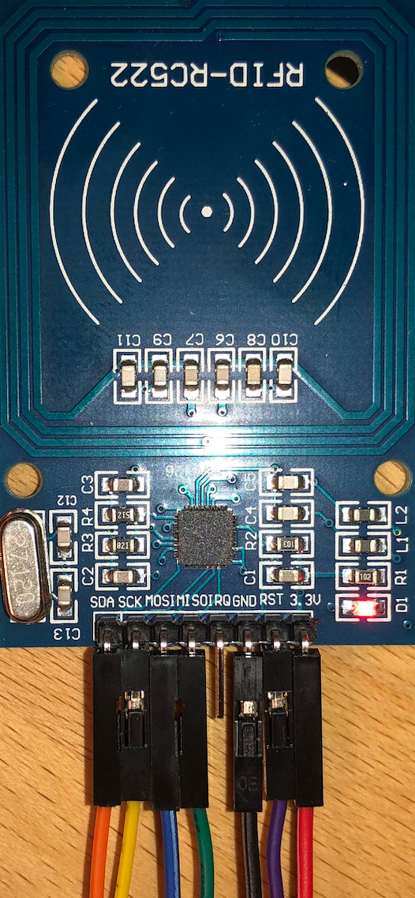
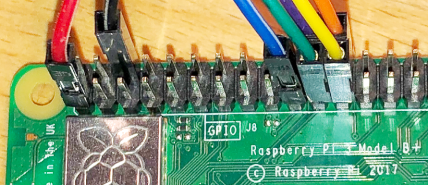

Testing a RFID-RC522 board on a Raspberry Pi 3 B+
=================================================

Note: Most of this writing is based on https://tutorials-raspberrypi.de/raspberry-pi-rfid-rc522-tueroeffner-nfc/.

The previous mentioned blog post lacks Python 3 functionality (`SyntaxError: Missing parentheses in call to 'print'. Did you mean print("Ctrl+C captured, ending read.")?`) and is incompatible with the MFRC522-python project (`TypeError: function takes exactly 2 arguments (1 given)`.

My environment:
- Raspberry Pi 3 Model B+
- Arch Linux for ARM
- Up to date system (`pacman -Syu` as of 2019-12-08)
- Python 3

Cabling: see the related web site.




Specific to Arch Linux:

```
pacman -S python-pip
pip install RPi.GPIO
```

Clone git repositories, install SPI-Py and switch to python 3 branch:

```
git clone https://github.com/lthiery/SPI-Py.git
cd SPI-Py
python setup.py install
cd ..
git clone https://github.com/lucassarcanjo/MFRC522-python.git
cd MFRC522-python
git checkout python3-spi-updates
python Read.py
```
